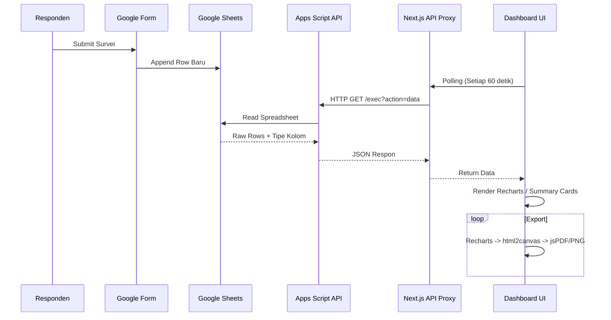

# PRD: Dashboard Survei Kepuasan Pemerintah Nasional

**Version:** 1.1  
**Author:** Haikal  
**Last Updated:** April 2026  
**Status:** In Development

---

## Table of Contents
1. [Overview](#1-overview)
2. [Goals & Success Metrics](#2-goals--success-metrics)
3. [Target Users](#3-target-users)
4. [Product Features](#4-product-features)
5. [UI/UX & Design Guidelines](#5-uiux--design-guidelines)
6. [Tech Stack](#6-tech-stack)
7. [Architecture & Data Flow](#7-architecture--data-flow)
8. [Apps Script API](#8-apps-script-api)
9. [Security & Privacy](#9-security--privacy)
10. [File Structure](#10-file-structure)
11. [Environment Variables](#11-environment-variables)
12. [Setup Guide](#12-setup-guide)
13. [Out of Scope (v1)](#13-out-of-scope-v1)
14. [Known Limitations](#14-known-limitations)

---

## 1. Overview

Dashboard real-time untuk memvisualisasikan hasil survei kepuasan pemerintah tingkat nasional. Data bersumber dari Google Form → Google Sheets → Google Apps Script API → Next.js dashboard.

Sistem dirancang **dinamis** — tidak ada pertanyaan atau kolom survei yang di-hardcode. Struktur chart otomatis menyesuaikan tipe data pada kolom di Google Sheet secara cerdas.

---

## 2. Goals & Success Metrics

| # | Goal | Success Metric (KPI) |
|---|---|---|
| G1 | Tampilkan hasil survei secara real-time tanpa reload manual | Fetch otomatis < 2 detik setelah interval 60s. |
| G2 | Visualisasi dinamis berdasarkan struktur kolom Sheet | 100% chart otomatis ter-render untuk tipe kolom yang valid. |
| G3 | Chart dan Data Report bisa diekspor | PNG dan PDF ter-generate < 3 detik per request. |
| G4 | Insight langsung dari data | Selalu ada top 4 summary card (Total, Hari Ini, Trend). |

---

## 3. Target Users

| Role | Deskripsi | Akses | Auth Method |
|---|---|---|---|
| **Surveyor (Admin)** | Pengelola survei yang menganalisis sentimen masyarakat. | Akses penuh ke dashboard, filter data, ekspor laporan. | Username + Password |

> [!NOTE]  
> v1 dipusatkan untuk 1 akun surveyor (single-tenant). Manajemen multi-user dengan role berbeda akan diimplementasikan pada v2.

---

## 4. Product Features

### F1 — Authentication
- Halaman login tertutup dengan form username + password.
- Session-based authentication via NextAuth.js (Credentials provider).
- Proteksi route `/dashboard/*` menggunakan sistem middleware Next.js.
- Redirect otomatis ke `/login` bagi unauthenticated user.

### F2 — Dynamic Chart Rendering
Data fetch dari Apps Script menghasilkan metadata kolom hasil sampling 100 baris pertama. UI otomatis menyesuaikan:

| Deteksi Tipe (Server) | Kriteria | Render Frontend |
|---|---|---|
| `scale` | Angka 1-5 atau 1-10 | **Bar chart** (distribusi frekuensi responden) |
| `categorical` | Pilihan ganda, dropdown (≤ 15 opsi) | **Donut/Pie chart** dengan legend |
| `timestamp` | Datetime object | **Area/Line chart** (tren pengisian per hari) |
| `numeric` | Angka bebas tanpa range tetap | **Summary Card** (Rata-rata, Min, Max) |
| `text` | Paragraf panjang / string bervariasi | Disembunyikan divisualisasi (hanya masuk CSV) |

### F3 — Executive Summary Cards
Komponen statis di header dashboard:
1. **Total Responden**: Akumulasi seluruh data.
2. **Hari Ini**: Jumlah pengisian hari ini.
3. **Kemarin**: Jumlah pengisian hari sebelumnya (sebagai baseline).
4. **Trend**: Indikator persentase pertumbuhan naik/turun vs kemarin (Warna Hijau/Merah).

### F4 — Auto-Refresh & Synchronization
- Background fetching **setiap 60 detik**.
- Indikator "Terakhir diperbarui: HH:MM:SS" responsif di header.
- Tombol integrasi *Manual Refresh*.

### F5 — Data Export Options
| Format | Cakupan | Trigger |
|---|---|---|
| **PNG** | Per-chart spesifik | Tombol di pojok kanan atas tiap card chart |
| **PDF** | Laporan lengkap (semua chart) | Tombol 'Export PDF' global di header |
| **CSV** | Data mentah tabular | Tombol 'Download CSV' global di header |

### F6 — Global Filtering
- Date picker (Start Date - End Date).
- Filter memicu sinkronisasi state ke seluruh sistem (Summary & Chart).

---

## 5. UI/UX & Design Guidelines

Untuk memastikan kesan *Premium* tingkat nasional, desain harus mengikuti aturan estetik modern:
- **Tema (Theme)**: Mendukung Light dan Dark mode yang smooth.
- **Palet Warna**: Menggunakan warna solid dan berwibawa khas pemerintah (seperti deep navy blue, emerald green, dan neutral zinc) tanpa terkesan kaku.
- **Bentuk (Shapes)**: *Rounded corners* (radii sedang) dengan *subtle shadow* dan *glassmorphism* di elemen melayang (dropdown / nav).
- **Tipografi**: Font modern sans-serif yang bersih (misalnya *Inter* atau *Outfit*).
- **Animasi (Micro-interactions)**: Transisi halus di elemen interaktif, hover effect pada card dan chart tooltip.

---

## 6. Tech Stack

| Layer | Dependency Utama | Alasan Pemilihan |
|---|---|---|
| **Frontend Foundation** | Next.js 14 (App Router) + React | Eksekusi cepat, optimal routing, dan performa tinggi. |
| **Styling & UI** | Tailwind CSS + Lucide React | Konsistensi UI, stylings *utility-first*, ikon modern yang scalable. |
| **Data Viz** | Recharts | Berbasis komponen React, ringan, dinamis, kustomisasi tinggi. |
| **State & Fetch** | SWR / React Query | Handle caching, polling otomatis 60s, state sync. |
| **Authentication** | NextAuth v4 | Standard industri React, proteksi mudah di App Router. |
| **Backend/Bridge** | Google Apps Script (Web App) | *Zero cost*, langsung bridging Google Form tanpa DB eksternal. |
| **Export Libs** | html2canvas + jsPDF | Standard untuk re-render elemen DOM menjadi asset statis. |
| **Deployment** | Vercel | Seamless CI/CD dengan Next.js. |

---

## 7. Architecture & Data Flow



> [!NOTE]  
> Next.js Server API berperan sebagai proxy layer yang efisien untuk melindungi kredensial (URL) Apps Script agar tidak bocor ke client-side.

---

## 8. Apps Script API

**Base URL:** `https://script.google.com/macros/s/{DEPLOYMENT_ID}/exec`

| Action Param | Tambahan Query | Output Respon |
|---|---|---|
| `metadata` | - | Array kolom beserta hasil deteksi tipe (scale, categorical, dll) |
| `data` | - | Raw data keseluruhan berformat array of JSON objects |
| `data` | `startDate`, `endDate` | Return raw data yang khusus terjadi di range tanggal |
| `summary` | - | Agregat instan: total, hari ini, kemarin, trend, dailyCounts |

---

## 9. Security & Privacy

Mengingat konteks data *Pemerintah Nasional*:
- Akses mutlak tertutup tanpa public sharing / open metrics.
- Tidak ada rekam jejak PII (Personally Identifiable Information) di cache Next.js yang terbuka secara publik.
- Variabel rahasia (`APPS_SCRIPT_URL`, `NEXTAUTH_SECRET`) wajib disimpan sepenuhnya pada Vercel Dashboard, bukan di hardcode pada repository.

---

## 10. File Structure

```text
survey-dashboard/
├── PRD.md
├── .env.local.example
├── tailwind.config.ts
├── tsconfig.json
│
├── apps-script/
│   └── Code.gs                          # Backend GAS logic (.gs file)
│
└── src/
    ├── middleware.ts                     # Auth Guard untuk wildcard /dashboard/*
    │
    ├── app/
    │   ├── page.tsx                      # Automatic redirect logic -> /dashboard
    │   ├── login/page.tsx                # Halaman login estetis
    │   ├── dashboard/page.tsx            # Frame utama dashboard 
    │   └── api/
    │       ├── auth/[...nextauth]/route.ts
    │       └── survey/route.ts           # Proxy handler GAS
    │
    ├── components/
    │   ├── layout/
    │   │   ├── Header.tsx                # Logo, Jam, Export, Profil
    │   │   └── FilterBar.tsx             # Date picker filter global
    │   ├── dashboard/
    │   │   └── SummaryCards.tsx          # 4 Executive cards
    │   └── charts/
    │       ├── BaseChartCard.tsx         # HOC Wrapper untuk container & logic download
    │       ├── DynamicBarChart.tsx       # Renderer: `scale` data
    │       ├── DynamicPieChart.tsx       # Renderer: `categorical` data
    │       └── DynamicLineChart.tsx      # Renderer: `timestamp` data
    │
    ├── lib/
    │   ├── apps-script.ts                # Fetch utility
    │   ├── aggregator.ts                 # Processor data dari API (client-side backup)
    │   └── exportUtils.ts                # Wrapper html2canvs & jspdf
    │
    └── types/
        └── index.d.ts                    # Global Typescript interfaces
```

---

## 11. Environment Variables

Pastikan variabel-variabel ini selalu dikonfigurasi saat proses setup di `.env.local` atau Cloud Runtime:

```env
# URL Dashboard lokal atau production
NEXTAUTH_URL=http://localhost:3000

# Kunci JWT untuk sesi (Generate via openssl rand -base64 32)
NEXTAUTH_SECRET=your-random-secret-min-32-chars

# Target web app Google Script Proxy
APPS_SCRIPT_URL=https://script.google.com/macros/s/YOUR_DEPLOYMENT_ID/exec

# Kredensial Login v1
SURVEYOR_USERNAME=admin
SURVEYOR_PASSWORD=your-secure-password
```

---

## 12. Setup Guide

### 1) Setup Backend (Google Apps Script)
1. Buka Google Sheet tempat respons data Google Form masuk.
2. Navigasi: **Extensions (Ekstensi)** → **Apps Script**.
3. *Copy-paste* isi file `apps-script/Code.gs`.
4. Pilih **Deploy** → **New deployment** → Pilih type **Web App**.
   - Execute as: **Me** (Wajib).
   - Who has access: **Anyone**. (Aman, URL di-proxy oleh backend server Next.js kita).
5. Salin *URL Deployment* yang baru terbentuk dan simpan sebagai `APPS_SCRIPT_URL`.

### 2) Setup Frontend (Lokal)
```bash
git clone <repo>
cd survey-dashboard

# Install dependensi
npm install

# Setup env
cp .env.local.example .env.local
# (Edit values di text editor kesayangan Anda)

# Jalankan dev server lokal
npm run dev
```

---

## 13. Out of Scope (v1)

> [!CAUTION]  
> Untuk menjaga timeline rilis v1, hal-hal berikut ditangguhkan hingga v2:

- **Sistem Role-based Muti-User**: Saat ini menggunakan single-tenant admin access. Di v2 dipertimbangkan penggunaan Auth eksternal seperti Supabase/Firebase.
- **Data Editing / Management Database**: Dashboard V1 bersifat *Read-Only*. Pengubahan kesalahan isi formulir sepenuhnya harus dari dalam Google Sheet.
- **WebSocket Streaming**: Refresh time real-time berbasis *Polling* 60 detik dirasa cukup optimal. *Strict Realtime* Web Socket belum diperlukan.
- **Natural Language Analysis**: Menganalisis opini `text` bebas belum dilakukan. Ini memerlukan integrasi API AI (seperti Gemini/OpenAI).

---

## 14. Known Limitations

> [!WARNING]  
> - **Limit Kapasitas**: Terdapat batas *payload response* dari Apps Script API maksimal **sekitar 6-10 MB**. Apabila total baris menyentuh puluhan ribu, pagination *mandatory* diaplikasikan di proxy.
> - **Cold Start**: Respon pemanggilan Apps Script API pertama kalinya (saat belum disentuh lama) berpotensi memakan waktu hingga **2–5 detik**. Request selanjutnya memakan hitungan milidetik.
> - **Kualitas Export PDF**: Export dirender via Canvas (Raster Graphics), kualitas ketajaman chart yang dizoom secara agresif pada file PDF tidak menyamai kualitas vector-native (*svg*).
